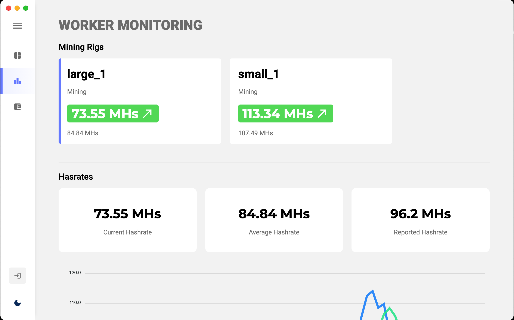

# Corsair Monitor [![frontend-shield]][frontend-repo] [![backend-shield]][backend-repo]

Web/Desktop application for monitoring ETH crypto miners on the [ethermine](https://www.ethermine.org) pool from wallet(s).

## Instalation

```
npm install
```
## Run

* ### Webapp

```
npm run serve
```

* ### Webapp + Desktop app

```
npm run dev
```

## Screenshot (Worker Monitoring)



[frontend-shield]: https://github.com/noahgreff/corsair-monitor/workflows/Webapp%20Deployment/badge.svg
[frontend-repo]: https://github.com/noahgreff/corsair-monitor

[backend-shield]: https://github.com/noahgreff/corsair-monitor-backend/workflows/Webapp%20Deployment/badge.svg
[backend-repo]: https://github.com/noahgreff/corsair-monitor-backend
